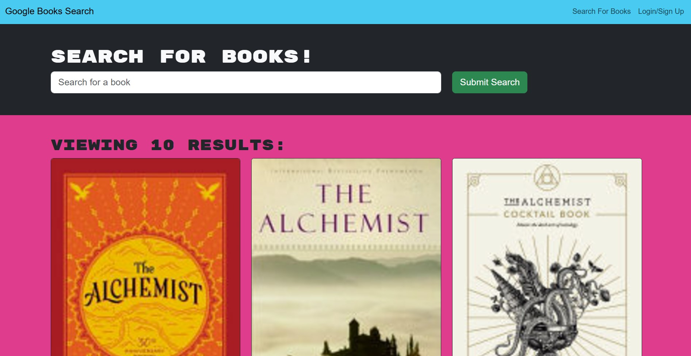

# **Book Search Engine**

## **Description**
An interactive book search application where users can find books, save their favorites, and manage their reading list. This application uses the Google Books API and features user authentication for a personalized experience.

## **Technologies Used**

- **MongoDB**: Database for storing user information and saved books.
- **Express.js**: Backend framework for handling routes and API logic.
- **React.js**: Frontend library for a dynamic and interactive UI.
- **Node.js**: Server runtime environment.
- **Google Books API**: Provides book data for searches.
- **JWT (JSON Web Tokens)**: Secure user authentication and session management.

## Usage
Search for books by entering a keyword in the search bar.
Sign up or log in to save books to your personal list.
View and manage saved books in the Saved Books section.
Logout when finished to secure your account.

## License
This project is licensed under the MIT License. See the LICENSE file for details.

# Repo
Below is the Repo URL address 
https://github.com/madybt/challenge21

# Render
Below is the Render URL
https://challenge21-b8yr.onrender.com

below is the screenshot of the page
